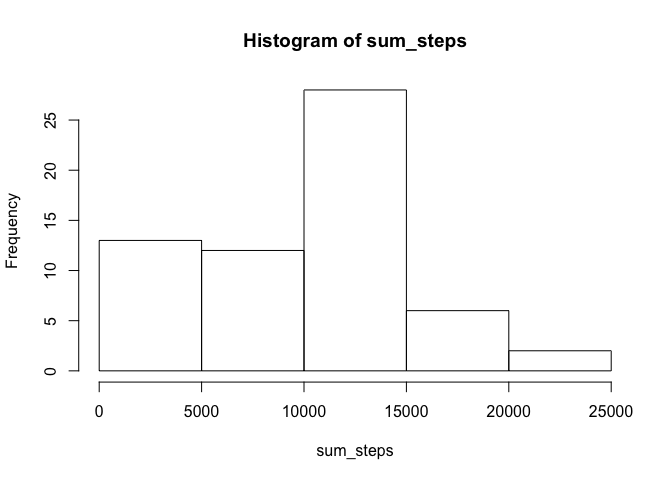
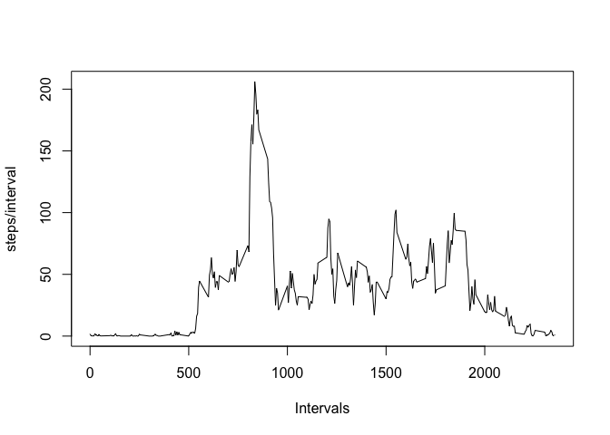
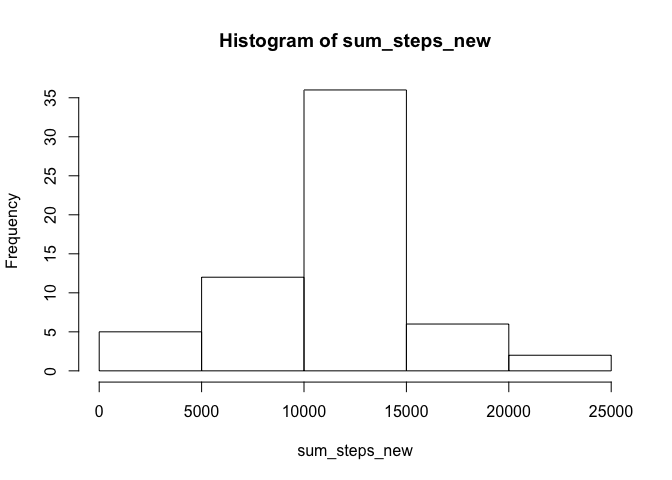
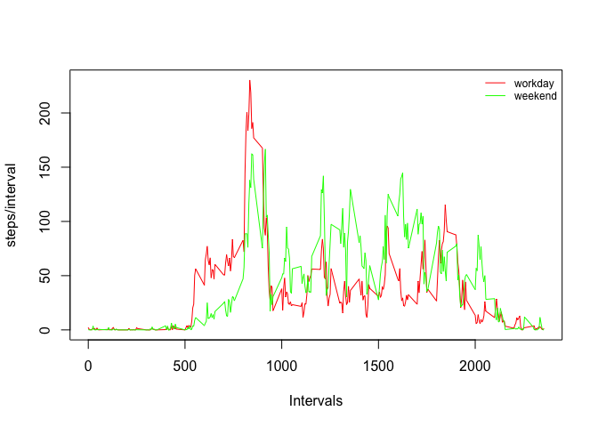

# Reproducible Research: Peer Assessment 1


## Loading and preprocessing the data

Load the data (i.e. read.csv())
Process/transform the data (if necessary) into a format suitable for your analysis


```r
unzip("activity.zip")
data <- read.csv(file = "activity.csv",header = TRUE,sep=",")
summary(data)
```

```
##      steps                date          interval     
##  Min.   :  0.00   2012-10-01:  288   Min.   :   0.0  
##  1st Qu.:  0.00   2012-10-02:  288   1st Qu.: 588.8  
##  Median :  0.00   2012-10-03:  288   Median :1177.5  
##  Mean   : 37.38   2012-10-04:  288   Mean   :1177.5  
##  3rd Qu.: 12.00   2012-10-05:  288   3rd Qu.:1766.2  
##  Max.   :806.00   2012-10-06:  288   Max.   :2355.0  
##  NA's   :2304     (Other)   :15840
```


## What is mean total number of steps taken per day?

Make a histogram of the total number of steps taken each day

```r
sum_steps <- tapply(data$steps,data$date,FUN = function(x) {sum(x, na.rm = TRUE)} )
hist(sum_steps)
```

 

Calculate and report the mean and median total number of steps taken per day

```r
mean(sum_steps)
```

```
## [1] 9354.23
```

```r
median(sum_steps)
```

```
## [1] 10395
```

```r
summary(sum_steps)
```

```
##    Min. 1st Qu.  Median    Mean 3rd Qu.    Max. 
##       0    6778   10400    9354   12810   21190
```

## What is the average daily activity pattern?

Make a time series plot (i.e. type = "l") of the 5-minute interval (x-axis) and the average number of steps taken, averaged across all days (y-axis)

```r
steps_interval <- tapply(data$steps,data$interval,FUN = function(x) {mean(x, na.rm = TRUE)} )
plot (steps_interval, type="l",x = names(steps_interval),xlab="Intervals",ylab="steps/interval")
```

 

Which 5-minute interval, on average across all the days in the dataset, contains the maximum number of steps?

```r
steps_interval[steps_interval==max(steps_interval)]
```

```
##      835 
## 206.1698
```

## Imputing missing values

Calculate and report the total number of missing values in the dataset (i.e. the total number of rows with NAs)

```r
sum(is.na(data$steps))
```

```
## [1] 2304
```

Number of NA by day

```r
tapply(is.na(data$steps),data$date,FUN=sum)
```

```
## 2012-10-01 2012-10-02 2012-10-03 2012-10-04 2012-10-05 2012-10-06 
##        288          0          0          0          0          0 
## 2012-10-07 2012-10-08 2012-10-09 2012-10-10 2012-10-11 2012-10-12 
##          0        288          0          0          0          0 
## 2012-10-13 2012-10-14 2012-10-15 2012-10-16 2012-10-17 2012-10-18 
##          0          0          0          0          0          0 
## 2012-10-19 2012-10-20 2012-10-21 2012-10-22 2012-10-23 2012-10-24 
##          0          0          0          0          0          0 
## 2012-10-25 2012-10-26 2012-10-27 2012-10-28 2012-10-29 2012-10-30 
##          0          0          0          0          0          0 
## 2012-10-31 2012-11-01 2012-11-02 2012-11-03 2012-11-04 2012-11-05 
##          0        288          0          0        288          0 
## 2012-11-06 2012-11-07 2012-11-08 2012-11-09 2012-11-10 2012-11-11 
##          0          0          0        288        288          0 
## 2012-11-12 2012-11-13 2012-11-14 2012-11-15 2012-11-16 2012-11-17 
##          0          0        288          0          0          0 
## 2012-11-18 2012-11-19 2012-11-20 2012-11-21 2012-11-22 2012-11-23 
##          0          0          0          0          0          0 
## 2012-11-24 2012-11-25 2012-11-26 2012-11-27 2012-11-28 2012-11-29 
##          0          0          0          0          0          0 
## 2012-11-30 
##        288
```

Devise a strategy for filling in all of the missing values in the dataset. The strategy does not need to be sophisticated. For example, you could use the mean/median for that day, or the mean for that 5-minute interval, etc.


```r
summary(data)
```

```
##      steps                date          interval     
##  Min.   :  0.00   2012-10-01:  288   Min.   :   0.0  
##  1st Qu.:  0.00   2012-10-02:  288   1st Qu.: 588.8  
##  Median :  0.00   2012-10-03:  288   Median :1177.5  
##  Mean   : 37.38   2012-10-04:  288   Mean   :1177.5  
##  3rd Qu.: 12.00   2012-10-05:  288   3rd Qu.:1766.2  
##  Max.   :806.00   2012-10-06:  288   Max.   :2355.0  
##  NA's   :2304     (Other)   :15840
```


Create a new dataset that is equal to the original dataset but with the missing data filled in.


```r
library(plyr)
data_filled <- mutate(data,steps=ifelse(!is.na(data$steps),data$steps,steps_interval))
summary(data_filled)
```

```
##      steps                date          interval     
##  Min.   :  0.00   2012-10-01:  288   Min.   :   0.0  
##  1st Qu.:  0.00   2012-10-02:  288   1st Qu.: 588.8  
##  Median :  0.00   2012-10-03:  288   Median :1177.5  
##  Mean   : 37.38   2012-10-04:  288   Mean   :1177.5  
##  3rd Qu.: 27.00   2012-10-05:  288   3rd Qu.:1766.2  
##  Max.   :806.00   2012-10-06:  288   Max.   :2355.0  
##                   (Other)   :15840
```

Make a histogram of the total number of steps taken each day and Calculate and report the mean and median total number of steps taken per day. Do these values differ from the estimates from the first part of the assignment? What is the impact of imputing missing data on the estimates of the total daily number of steps?


```r
sum_steps_new <- tapply(data_filled$steps,data_filled$date,FUN = function(x) {sum(x, na.rm = TRUE)} )
hist(sum_steps_new)
```

 


## Are there differences in activity patterns between weekdays and weekends?

Create a new factor variable in the dataset with two levels -- "weekday" and "weekend" indicating whether a given date is a weekday or weekend day.

```r
data_filled$wday <- factor(weekdays(as.Date(data_filled$date)))
data_filled <-mutate (data_filled,typeDay=factor(ifelse(wday=="Sunday" | wday=="Saturday","Weekend","Workday")))
summary(data_filled)
```

```
##      steps                date          interval             wday     
##  Min.   :  0.00   2012-10-01:  288   Min.   :   0.0   Friday   :2592  
##  1st Qu.:  0.00   2012-10-02:  288   1st Qu.: 588.8   Monday   :2592  
##  Median :  0.00   2012-10-03:  288   Median :1177.5   Saturday :2304  
##  Mean   : 37.38   2012-10-04:  288   Mean   :1177.5   Sunday   :2304  
##  3rd Qu.: 27.00   2012-10-05:  288   3rd Qu.:1766.2   Thursday :2592  
##  Max.   :806.00   2012-10-06:  288   Max.   :2355.0   Tuesday  :2592  
##                   (Other)   :15840                    Wednesday:2592  
##     typeDay     
##  Weekend: 4608  
##  Workday:12960  
##                 
##                 
##                 
##                 
## 
```

Make a panel plot containing a time series plot (i.e. type = "l") of the 5-minute interval (x-axis) and the average number of steps taken, averaged across all weekday days or weekend days (y-axis).


```r
weekend <- subset(data_filled,typeDay=="Weekend")
workday <- subset(data_filled,typeDay=="Workday")
steps_work <- tapply(workday$steps,workday$interval,FUN = mean)
steps_wend <- tapply(weekend$steps,weekend$interval,FUN = mean)
plot (steps_work, type="l",x = names(steps_work),xlab="Intervals",ylab="steps/interval",col="red")
lines (steps_wend, type="l",x = names(steps_wend),xlab="Intervals",ylab="steps/interval",col = "green")
legend('topright', c("workday","weekend"), lty=1, col=c('red', 'green'), bty='n', cex=.75)
```

 
